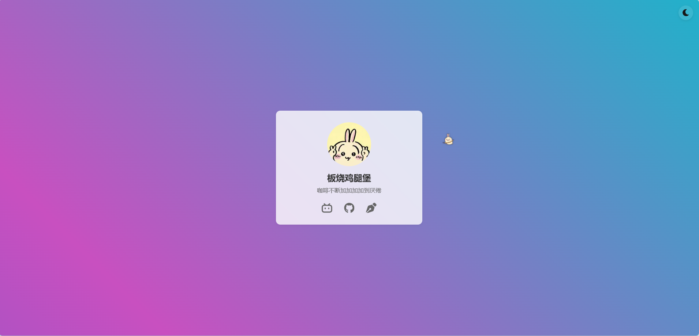

<div align="center">

# 个人主页 | Personal Homepage

一个使用 Next.js 构建的个人主页，展示了一些有趣的交互效果。

A personal homepage built with Next.js, featuring various interactive elements.

[简体中文](./README.md) | [English](./README_EN.md)

[](https://www.notrespond1ng.top)

🔗 [在线预览 | Live Demo](https://www.notrespond1ng.top)

</div>

## ✨ 特性

- 🌓 深色/浅色模式切换
- 🍔 点击背景掉落汉堡
- 🐰 可爱的兔子指针
- 🎨 动态渐变背景
- 📊 Google Analytics 集成
- 🔒 Cookie 隐私提示
- 📱 响应式设计

## 🛠️ 技术栈

- Next.js 14
- TypeScript
- CSS Modules
- React Icons

## 🚀 本地开发

```bash
# 克隆仓库
git clone https://github.com/NotRespond1ng/homepage.git

# 进入项目目录
cd homepage

# 安装依赖
npm install

# 启动开发服务器
npm run dev
```

然后在浏览器打开 [http://localhost:3000](http://localhost:3000) 查看效果。

## 📦 部署

项目使用 PM2 在 Ubuntu 服务器上部署，通过 Nginx 反向代理提供服务。

### 部署步骤

1. 构建项目
```bash
npm run build
```

2. 使用 rsync 同步到服务器
```bash
# 确保 rsync.sh 有执行权限
chmod +x rsync.sh
# 运行同步脚本
./rsync.sh
```

3. 在服务器上使用 PM2 启动
```bash
pm2 start npm --name "homepage" -- start
```

## 📝 配置说明

- `next.config.js`: Next.js 配置文件
- `rsync.sh`: 部署脚本
- `nginx/`: Nginx 配置文件

## 🤝 贡献

欢迎提交 Issue 和 Pull Request！

## 📄 许可

[MIT License](./LICENSE)

## 🙏 致谢

- [Next.js](https://nextjs.org/)
- [React Icons](https://react-icons.github.io/react-icons/)
- [Google Analytics](https://analytics.google.com/)
