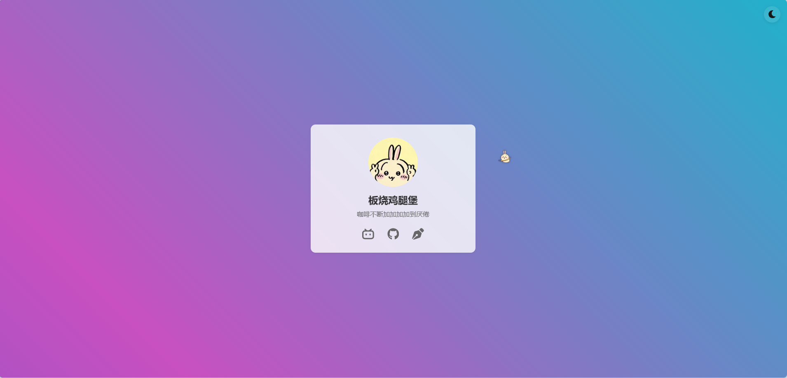

<div align="center">

# Personal Homepage | 个人主页

A personal homepage built with Next.js, featuring various interactive elements.

一个使用 Next.js 构建的个人主页，展示了一些有趣的交互效果。

[English](./README_EN.md) | [简体中文](./README.md)

[](https://www.notrespond1ng.top)

🔗 [Live Demo | 在线预览](https://www.notrespond1ng.top)

</div>

## ✨ Features

- 🌓 Dark/Light mode toggle
- 🍔 Falling burger animation
- 🐰 Cute bunny cursor
- 🎨 Dynamic gradient background
- 📊 Google Analytics integration
- 🔒 Cookie consent
- 📱 Responsive design

## 🛠️ Tech Stack

- Next.js 14
- TypeScript
- CSS Modules
- React Icons

## 🚀 Getting Started

```bash
# Clone the repository
git clone https://github.com/NotRespond1ng/homepage.git

# Enter the project directory
cd homepage

# Install dependencies
npm install

# Start development server
npm run dev
```

Then open [http://localhost:3000](http://localhost:3000) in your browser.

## 📦 Deployment

The project is deployed on Ubuntu server using PM2 and Nginx as reverse proxy.

### Deployment Steps

1. Build the project
```bash
npm run build
```

2. Sync to server using rsync
```bash
# Make sure rsync.sh is executable
chmod +x rsync.sh
# Run sync script
./rsync.sh
```

3. Start with PM2 on server
```bash
pm2 start npm --name "homepage" -- start
```

## 📝 Configuration

- `next.config.js`: Next.js configuration
- `rsync.sh`: Deployment script
- `nginx/`: Nginx configuration files

## 🤝 Contributing

Issues and Pull Requests are welcome!

## 📄 License

[MIT License](./LICENSE)

## 🙏 Acknowledgments

- [Next.js](https://nextjs.org/)
- [React Icons](https://react-icons.github.io/react-icons/)
- [Google Analytics](https://analytics.google.com/) 